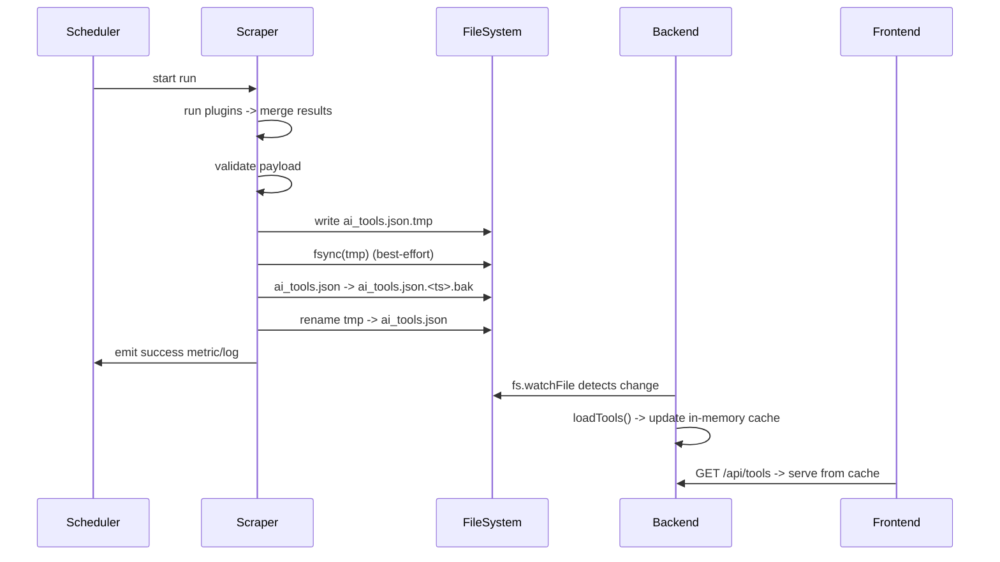

SCRAPER: Locked Technical Execution Plan

Goal
- Provide a small, robust background scraper that reliably produces data/ai_tools.json using atomic, validated updates. The backend reads and watches this file and serves it from memory.

Scope (Phase 1)
- Implement a single-writer scraper runner that:
  - runs plugin scrapers,
  - validates output (root array, id and name fields),
  - writes atomically with a timestamped backup retained for 72 hours,
  - exposes an integration test that exercises the end-to-end path.
- CI job that runs the integration test on PRs and pushes.

Non-goals
- Full distributed leader-election or multi-writer locking (phase 2)
- Prometheus metrics exposition (phase 2; we include a roadmap)

Architecture (components)
- Scheduler (K8s CronJob, GitHub Actions workflow, or system cron)
- Scraper container (packages/scraper): loads plugin scrapers, runs them, validates, and writes data/ai_tools.json using safe-replace
- File store (shared volume / blob): data/ai_tools.json and backups
- Backend (packages/backend): reads data/ai_tools.json into memory at startup; fs.watchFile reloads on change
- Frontend / consumers: query backend /api/tools

Sequence (high level)


File state transitions

```mermaid
stateDiagram-v2
  [*] --> Idle: ai_tools.json valid
  Idle --> Updating: new tmp write
  Updating --> Replacing: tmp fsynced; moving backup
  Replacing --> Idle: rename tmp->ai_tools.json (valid)
  Replacing --> Rollback: validation failed or write error
  Rollback --> Idle: restore backup
  Idle --> Corrupt: manual/other failure
```


Trust boundaries & security
- Scrapers may fetch external content; keep credentials out of repo and use environment variables or secret management.
- The file directory is trusted by the backend; ensure file permissions and single-writer semantics in production (scheduler level or distributed lock).

Failure modes & mitigations
- Malformed output: validator prevents replace; no change to live file; emit failure metric and alert.
- Partial write / truncated file: temp-file + atomic rename avoids exposing partial writes.
- Disk full: write errors surfaced; alert and keep last-good backup.
- Concurrent writers: avoid by scheduling a single writer or implement a lock service; plan for leader election if multi-instance is required.
- Windows rename semantics: implementation writes backup first, then rename tmp -> live; this avoids overwrite-on-rename edge cases.

Testing & Acceptance Criteria
- Unit tests
  - validate.js: assert schema checks error on missing id/name and accept good items.
  - safeReplace.js: test tmp creation, backup creation, and rename behavior (mock FS in unit tests).
- Integration tests (exists)
  - packages/scraper/test/integration.js: runs scraper to a temp dir, starts a tiny HTTP server mimicking backend, queries /api/tools and asserts results; verifies backup created on second run.
  - Acceptance: test passes on CI and locally.
- End-to-end smoke (phase 1 optional)
  - Run scraper -> start real backend pointing at the same temp dir -> GET /api/tools and assert results.
  - Acceptance: backend returns expected results without restart.

CI and release
- Minimal CI: run `npm --prefix packages/scraper test` on PRs and pushes to main.
- For release: build Docker image (packages/scraper/Dockerfile) and push to registry; schedule via K8s CronJob or a managed scheduler.

Observability (roadmap)
- Emit structured logs for run_start/run_success/run_failure with record counts and duration.
- Expose Prometheus metrics endpoint /metrics (future) or push metrics to an existing metrics pipeline.

Operational runbook (quick)
1. Run locally: `node src/index.js --out-dir ./data --once` from packages/scraper
2. Inspect logs for scraper-run-success and record counts.
3. If backend reports parsing errors: inspect `data/` and restore latest `ai_tools.json.<ts>.bak` using safe-replace procedure.

Appendix: K8s CronJob (example)
```yaml
apiVersion: batch/v1
kind: CronJob
metadata:
  name: ai-tools-scraper
spec:
  schedule: "0 * * * *" # hourly
  jobTemplate:
    spec:
      template:
        spec:
          containers:
          - name: scraper
            image: <registry>/gstack-scraper:latest
            args: ["--out-dir","/data","--once"]
            volumeMounts:
            - name: data
              mountPath: /data
          restartPolicy: OnFailure
          volumes:
          - name: data
            persistentVolumeClaim:
              claimName: ai-tools-data-pvc
```

Roadmap (phase 2)
- Add metrics exposition and alerting.
- Add distributed lock/leader election for multi-replica setups.
- Harden backups retention and automatic rollback windows.
